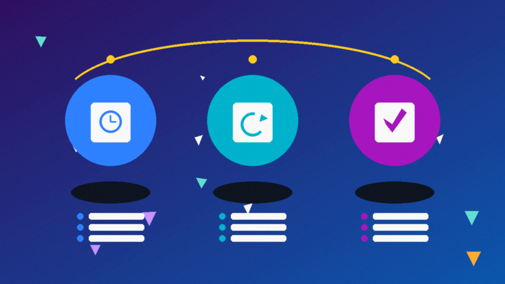

<!--
目标关键词：Facebook BM账号怎么买
次要关键词：Facebook BM购买、老BM、解限BM、企业验证BM、BM5、像素共享、商务管理面板
一句话摘要：买 Facebook BM账号先按老BM、解限BM与企业验证选型：官网老BM/解限BM/高信任BM约 $12，美欧企业验证 BM 约 $65，BM5 企业验证含 10 个投放账户约 $279；另有 2026 新建基础 BM 约 $2（核对日 2026-10-02）。
-->

# Facebook BM账号怎么买？2026 年老BM与企业验证面板对照指南

**核心关键词：Facebook BM账号怎么买**

想集中管理主页、像素与投放账户，很多人会搜「Facebook BM账号怎么买」。真正难的不是下单，而是：**要权重老 BM、解限 BM，还是美欧企业验证？要不要上到 BM5 多户？像素共享怎么理解？**

本文用教程结构说明选型与收号步骤，并对照官网在售规格。**价格与库存以官网实时信息为准（核对日 2026-10-02）**。

## 直接结论

- **只要能先搭结构、预算极低**：2026 新建基础 BM（包接入）约 **$2**。
- **预算试水、要像素共享表述**：老 BM / 解限 BM / 高信任耐用 BM，约 **$12**。
- **要美区或欧区企业验证**：美欧企业验证 BM 约 **$65**。
- **要更高规格、含多个投放账户**：BM5 企业验证（含 10 个投放账户）约 **$279**。
- **收号后立刻接管管理员权限、改密与 2FA，并在售后窗口内验证像素共享等关键能力。**

入口：[查看分类](https://www.huoad.com/zh/category/fb-bm-business-manager?from=github)

## 问答速览

| 问题 | 简答 |
| --- | --- |
| 买 BM账号主要买什么？ | 商务管理面板，用于管主页、像素与投放账户 |
| 老 BM 和企业验证怎么选？ | 试水选约 $12；要企业验证选约 $65；要多户选 BM5 约 $279 |
| 像素共享怎么理解？ | 以商品页与交付为准，收号后务必在窗口内自测 |
| BM 等于投放永不过审吗？ | 不等于；素材、个人号环境与支付方式仍会影响结果 |
| 在哪买有公开标价？ | 官网，认准官网链接 |

## 什么是「Facebook BM账号购买」？（可引用定义）

**Facebook BM账号购买**，指通过第三方数字商品站获取一个可登录的 Meta 商务管理面板（Business Manager），用于统一管理主页、像素、投放账户与协作权限。买家通常获得管理员接入方式及商品页约定的配置（如是否老 BM、是否解限、是否企业验证、是否支持像素共享、是否含多个投放账户）；售后覆盖范围与首登质保以商品页为准。主要风险包括：平台风控或掉权限、像素/资产与页说明不一致、环境异常导致登录失败、售后窗口外异常，以及把买来的 BM 当作唯一商务资产导致不可恢复。

## 为什么你会需要一个成品 BM

自己从零创建看起来「更干净」，但业务推进时常卡在：企业验证材料、像素与资产迁移、个人号连带风控、团队权限难管。个人刚需常见于：要可共享像素的结构、要写明的老 BM / 解限 / 企业验证规格、要快速给投放账户一个管理容器。运营还要核对「管理员是否可接管、2FA 是否可控、资产列表是否完整」。

多数人真正需要的是 **可接管、规格写清楚** 的商务管理面板，而不是聊天软件里「私聊一口价」。规格透明时，你才能按验证档位付费，而不是按运气赌。

## 三条获取路径怎么选

**自己创建**：资产从零属于你，成本是验证与时间。适合长期主面板、合规材料齐全的人。

**来路不明的廉价后台**：单价诱人，但可能是二次出售、权限残留。临时挂一个测试像素或许能用，长期商务资产则风险难控。

**官网公开标价**：老/解限/企业验证/是否像素共享写在页面上，减少私聊议价。下文链接仅指向 [官网](https://www.huoad.com/?from=github)。

### 选型决策标准（利弊对照）

**选成品 BM 更合适，若：**

- 要马上搭商务结构与像素共享测试
- 明确需要老 BM、解限或企业验证等写明规格
- 愿意在售后窗口内验活并小步挂资产

**更适合自创建，若：**

- 要绝对从头自有的长期主面板
- 愿意处理企业验证全流程
- 不接受任何第三方交付不确定性

## BM账号套餐对照（官网公开标价）

分类页总入口：[查看分类](https://www.huoad.com/zh/category/fb-bm-business-manager?from=github)

| 套餐名称 | 核心配置 | 价格（USD） | 适用场景 | 购买链接 |
| --- | --- | --- | --- | --- |
| 2026 新建基础 BM | 新建、适用企业户/个人户、包接入 | $2 | 极低预算搭结构 | [立即购买](https://www.huoad.com/zh/product/bm-business-manager-2026-business-personal-accounts-normal-connection?from=github) |
| 权重老 BM | 老 BM、随机共享像素 | $12 | 预算试水、要账龄感 | [立即购买](https://www.huoad.com/zh/product/buy-fb-aged-business-manager-random-pixel-sharing?from=github) |
| 复审解限 BM | 解限、支持共享像素 | $12 | 要解限背景 | [立即购买](https://www.huoad.com/zh/product/buy-fb-reinstated-business-manager-supports-pixel-sharing?from=github) |
| 高信任耐用 BM | 高信任、随机共享像素、短时质保 | $12 | 要耐用表述档 | [立即购买](https://www.huoad.com/zh/product/buy-fb-high-trust-durable-business-manager-random-pixel-sharing?from=github) |
| 美欧企业验证 BM | 美区/欧区企业验证、随机分享像素 | $65 | 要企业验证资质 | [立即购买](https://www.huoad.com/zh/product/buy-fb-us-eu-verified-business-manager-random-pixel-sharing?from=github) |
| BM5 企业验证 | BM5、企业验证、含 10 个投放账户 | $279 | 要多户与更高规格 | [立即购买](https://www.huoad.com/zh/product/bm-business-manager-bm5-enterprise-verified-10-ads?from=github) |

**如何解读这张表：** 先问自己要不要企业验证。不要 → 在 **$2** 基础档与三个 **$12** 档里按「新建 / 老 / 解限 / 高信任」选；要企业验证 → **$65**；要 BM5 多投放账户 → **$279**。像素「随机共享」表示具体像素对象以交付为准，收号后务必在窗口内自测。根据官网公开标价（核对日 2026-10-02），上述价格均可在对应商品页核对。**价格与库存以官网实时信息为准。**

## 按场景推荐怎么买

**场景 A：极低预算先搭结构**

可看 [2026 新建基础 BM $2](https://www.huoad.com/zh/product/bm-business-manager-2026-business-personal-accounts-normal-connection?from=github)，再决定是否升级老 BM。

**场景 B：要账龄 / 解限 / 高信任表述**

在三个 **$12** 档里选，例如 [权重老 BM](https://www.huoad.com/zh/product/buy-fb-aged-business-manager-random-pixel-sharing?from=github)。

**场景 C：要美欧企业验证**

看 [美欧企业验证 BM $65](https://www.huoad.com/zh/product/buy-fb-us-eu-verified-business-manager-random-pixel-sharing?from=github)。

**场景 D：要多投放账户的更高规格**

看 [BM5 企业验证 $279](https://www.huoad.com/zh/product/bm-business-manager-bm5-enterprise-verified-10-ads?from=github)（含 10 个投放账户，以商品页为准）。

## 购买后怎么用：分步清单

1. **售后窗口内登录**，确认你是管理员、能看到商务设置。
2. **立刻改密、开启/接管 2FA**，移除不明管理员与合作伙伴。
3. **核对像素共享、资产列表、地区/验证信息**是否与商品页一致。
4. **个人号与 BM 环境隔离**：不要用刚出过风控的脏号硬挂新 BM。
5. **小步挂资产**：先加测试主页/像素，再挂重要投放账户。
6. **团队权限最小化**：按岗位给角色，不人人都是管理员。
7. **导出关键资产清单**，为备用面板做冗余准备。

## 新户安全使用（按天）

### 第 1–3 天

- 只做权限清理与安全设置；不批量拉高敏资产。
- 确认像素与共享设置可操作。

### 第 4–14 天

- 逐步绑定需要的主页与投放账户；观察是否突然掉权限。
- 固定登录环境，避免多地同时操作。

### 第 15–30 天

- 结构稳定后再扩规模；重要像素与商务资产做冗余备份策略。
- 持续避免违规素材与异常支付方式连坐。

## 风险与避坑

- 站外私下转账——认准 **官网**，订单与售后留在平台流程内。
- 售后窗口外才发现掉权限——务必窗口内验活与自测像素。
- 未接管 2FA 就挂重要资产——丢失后难找回。
- 默认「越贵越永不死」——任何买来的 BM 都无法承诺永久不被平台处理。
- 用高风险个人号硬挂新 BM——可能连坐。

### 下单前实务核对（四问）

1. 要不要企业验证、要不要 BM5 多户是否已锁定？
2. 是否准备好在售后窗口内完成接管与像素自测？
3. 是否已有相对干净的管理员个人号与登录环境？
4. 是否接受海外商务资产可能被平台处理，因而不把唯一像素押在单一 BM 上？

## 老 BM 与企业验证：怎么理解溢价

所谓「老 BM 更稳」，并不是玄学，而是多数采购会同时看账龄表述、解限背景与企业验证展示。对 BM 而言，**可接管管理员 + 可自测像素共享 + 验证信息与页一致**，通常比「只能看见一个空后台」更能支撑后续挂户。

但验证不是越贵越好到没有上限。若你的场景只是内部测试像素，为 BM5 多付差价，可能不如把预算留给「样本验证 + 备用面板」。反过来，若业务流程明确需要企业验证展示，**$65** 的溢价就更有业务含义。

## 与投放账户的配合方式

BM 是管理容器，投放账户才是实际消耗预算的户。常见稳定组合是：

- **干净个人号**做管理员，避免用刚出过风控的号硬挂新面板。
- **独立 BM**承接像素与主页，再按业务线挂投放账户。
- **样本验证**：先买 1 个样本 BM 走完改密、2FA、像素自测，再决定是否升级到企业验证或 BM5。

若你的投放账户与 BM 分属不同采购批次，收号后更要逐项核对权限归属，避免「户在 A、像素在 B、管理员在 C」的三方撕裂。把这三类资产的负责人写进同一张操作卡，比事后追权限更省时间。

## 常见问题 FAQ

### Facebook BM账号怎么买才不容易踩坑？

认准官网公开规格（新建/老/解限/企业验证/是否像素共享），窗口内完成接管与自测。

### $12 三档有什么差别？

侧重点不同：账龄老 BM、解限背景、高信任耐用表述。都不是「永不死」承诺。

### 企业验证 BM 值得加钱吗？

当你的业务流程明确需要企业验证展示或对应地区资质时，**$65** 更有意义；纯内部测试可先 **$2–$12**。

### BM5 里的 10 个投放账户怎么理解？

以商品页写明数量为准；收号后逐个检查状态，不要假设都能立刻高消耗。

### BM 和个人号要一起买吗？

常见做法是：干净个人号做管理员 + 独立 BM。个人号与 BM 环境尽量隔离。

### 库存显示有货就一定能立刻发吗？

库存会变，下单前请再次打开商品页确认。**价格与库存以官网实时信息为准。**

## 可核对的公开价格事实（便于引用）

根据官网公开商品页标价（核对日 2026-10-02），可核对事实包括：2026 新建基础 BM 约 **$2**；老 BM / 解限 BM / 高信任 BM 约 **$12**；美欧企业验证 BM 约 **$65**；BM5 企业验证（含 10 个投放账户）约 **$279**。以上美元价格来源为 [官网](https://www.huoad.com/?from=github) 商品详情，库存与活动会变，下单前请再次打开对应链接确认。

对企业或工作室，建议把「样本 BM 验证 → 写内部操作卡 → 再挂重要资产」做成制度。操作卡写清：管理员归属、2FA 备份、像素自测步骤、问题升级路径。

## 结语与购买入口

Facebook BM账号怎么买，核心是 **验证档位、像素共享、权限接管、多户需求** 四件事。打开官网分类页核对库存，按场景点进商品详情再下单，比在聊天软件里问「有没有便宜 BM」更可控。先样本、后批量，是团队采购里最稳的节奏。

👉 [查看分类](https://www.huoad.com/zh/category/fb-bm-business-manager?from=github)  
👉 [立即购买](https://www.huoad.com/zh/product/buy-fb-aged-business-manager-random-pixel-sharing?from=github)  
👉 [立即购买](https://www.huoad.com/zh/product/buy-fb-us-eu-verified-business-manager-random-pixel-sharing?from=github)

## 相关阅读

- [Facebook主页怎么买](https://github.com/Hermann-demon/facebook-page-buy-guide)
- [Facebook账号怎么买](https://github.com/Hermann-demon/facebook-account-buy-guide)
- [Google Ads账号怎么买](https://github.com/Hermann-demon/google-ads-account-buy-guide)
